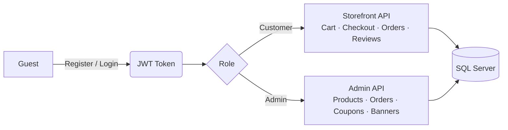
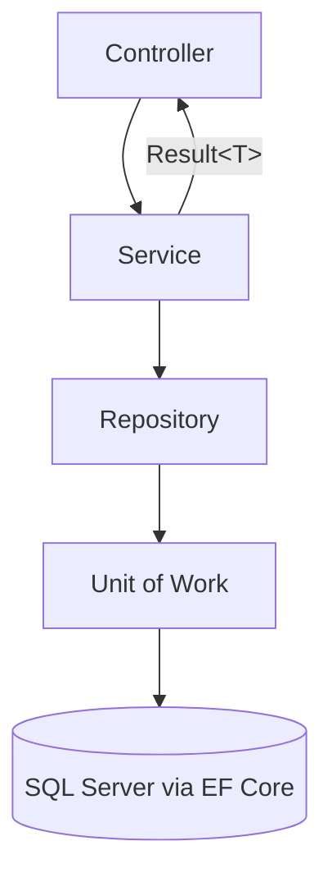

<div align="center">

# 🛒 E-commerce2

**A full-featured e-commerce REST API built with ASP.NET Core 9 & Entity Framework Core**

Storefront browsing • Cart & checkout • Coupons • Reviews • Admin dashboard API

[](https://dotnet.microsoft.com/)
[](https://learn.microsoft.com/ef/core/)
[](https://www.microsoft.com/sql-server)
[](https://jwt.io/)
[](#license)

</div>

---

## 📦 Tech Stack

| Layer | Technology |
|---|---|
| **Framework** | ASP.NET Core 9.0 (Web API) |
| **ORM** | Entity Framework Core 9.0 (SQL Server) |
| **Auth** | ASP.NET Core Identity + JWT Bearer authentication |
| **API Docs** | Scalar (OpenAPI UI) |
| **Architecture** | Repository + Unit of Work, layered Services / Controllers / DTOs |
| **Result Handling** | Custom `Result<T>` wrapper (no exceptions for expected failures) |

---

## ✨ Features

<table>
<tr>
<td valign="top" width="33%">

### 🛍️ Storefront
*(Public / Customer-facing)*

- Browse products by category
- Product details & variants (color/size)
- Banners, lookups (colors, sizes, governorates)
- Shopping cart management
- Checkout with coupons & shipping calc
- Order tracking by order # + email
- Submit & view product reviews
- Favorites / wishlist
- Profile & address book

</td>
<td valign="top" width="33%">

### 🛠️ Admin API

- Product / category / attribute mgmt
- Order management & status updates
- Coupon mgmt + campaign tracking
- Banner management
- Review moderation & pinning
- Customer list & summaries
- Shipping settings & rates
- Image / file uploads

</td>
<td valign="top" width="33%">

### 🔐 Auth & Identity

- Registration & login
- JWT token issuance
- Role-based authorization
  (`Admin`, `Customer`)
- Seeded roles & starter data
  on first run

</td>
</tr>
</table>

### 🗺️ High-Level Flow



---

## 🗂️ Project Structure

```
E-commerce2/
├── Controllers/
│   ├── AuthController.cs            # Register / Login
│   ├── ProfileController.cs         # User profile & addresses
│   ├── Admin/                       # Admin-only endpoints (Banners, Categories, Colors,
│   │                                 # Coupons, Customers, Orders, Products, Reviews,
│   │                                 # Shipping, Sizes, Uploads)
│   ├── Customer/                    # Authenticated customer endpoints (Orders, Products)
│   └── Storefront/                  # Public storefront endpoints (Banners, Cart, Categories,
│                                     # Checkout, Coupons, Favorites, Lookups, Orders, Reviews)
├── DataAccess/
│   ├── AppDbContext.cs              # EF Core DbContext (extends IdentityDbContext<User>)
│   ├── DataSeeder.cs                # Seeds roles, admin user, default governorate & settings
│   └── Configurations/              # Fluent API entity configurations
├── DTOs/Responses/                  # Request/response DTOs (records) per domain area
├── Migrations/                      # EF Core migrations
├── Models/                          # Domain entities (Product, Order, Cart, Coupon, Banner,
│                                     # Review, Favorite, Governorate, User, etc.) + Enums
├── Repositories/
│   ├── GenericRepository.cs / IGenericRepository.cs
│   ├── SpecificRepositories.cs      # Per-entity repositories
│   ├── UnitOfWork.cs
│   └── Interfaces/IRepositories.cs
├── Services/
│   ├── *.cs                         # Business logic per domain (Product, Order, Cart,
│   │                                 # Coupon, Category, Auth, Profile, Review, Shipping, etc.)
│   └── Interfaces/IServices.cs
├── Utilities/
│   ├── Result.cs                    # Generic Result<T> wrapper for service outcomes
│   ├── PaginatedList.cs             # Pagination helper
│   ├── IGenericRepository.cs
│   └── SD.cs                        # Static/shared definitions
└── Program.cs                       # App startup, DI registration, middleware pipeline
```

---

## 🚀 Getting Started

### Prerequisites
- [.NET 9 SDK](https://dotnet.microsoft.com/download)
- SQL Server (LocalDB is used by default) or another SQL Server instance

### Setup

1. **Clone the repository**
   ```bash
   git clone <repo-url>
   cd E-commerce2
   ```

2. **Configure the database connection**

   Update the `ConnectionStrings:DefaultConnection` value in `appsettings.json` / `appsettings.Development.json` if you're not using LocalDB:
   ```json
   "ConnectionStrings": {
     "DefaultConnection": "Data Source=(localdb)\\ProjectModels;Initial Catalog=Ecommerce2;..."
   }
   ```

3. **Apply migrations**
   ```bash
   dotnet ef database update
   ```

4. **Run the application**
   ```bash
   dotnet run
   ```

5. **Explore the API**

   In development mode, an OpenAPI reference UI is available via Scalar at the app's root/`/scalar` route once running.

> ℹ️ **Seeded data:** On first run, `DataSeeder` creates the `Admin`/`Customer` roles, a default admin account, a default governorate, and base store settings so the API is usable immediately. Check `DataAccess/DataSeeder.cs` and update the seeded credentials before using this in any shared or production environment.

---

## 🔑 Authentication

The API uses JWT Bearer tokens. Configure the JWT section in `appsettings.json`:

```json
"Jwt": {
  "Key": "<your-secret-key-at-least-32-bytes>",
  "Issuer": "ECommerce2API",
  "Audience": "ECommerce2FrontEnd",
  "ExpireDays": 7
}
```

1. `POST /api/Auth/register` — create an account
2. `POST /api/Auth/login` — obtain a JWT
3. Include the token as `Authorization: Bearer <token>` on subsequent requests to protected endpoints

---

## 📍 Key API Areas

| Area | Base Route | Access |
|---|---|:---:|
| Auth | `/api/Auth` | 🌐 Public |
| Profile | `/api/Profile` | 🔒 Authenticated |
| Storefront (browse) | `/api/storefront/*` | 🌐 Public |
| Storefront (cart/checkout/favorites) | `/api/storefront/*` | 🔒 Authenticated |
| Customer Orders | `/api/Orders` | 🔒 Authenticated |
| Admin | `/api/admin/*` | 🛡️ Admin role |

> ⚠️ **Security note:** `appsettings.json` in this repository contains a placeholder JWT signing key and seeded credentials committed to source control. Rotate these secrets (e.g. via user secrets or environment variables) before any real deployment.

---

## 🧱 Architecture Notes

- **Result Pattern** — Services return a `Result<T>` (see `Utilities/Result.cs`) to represent success/failure without throwing exceptions for expected business errors.
- **Pagination** — List endpoints commonly return a `PaginatedList<T>` for consistent paging metadata.
- **Repository + Unit of Work** — Data access is abstracted through `IGenericRepository<T>` / specific repositories, coordinated by `IUnitOfWork` for transactional `SaveChanges`.
- **Soft Deletes** — Products use a query filter (`IsDeleted`) so removed products are excluded from queries without losing historical data (e.g., for past orders).



---

## 📄 License

<div align="center">

Add your license of choice here.

</div>
